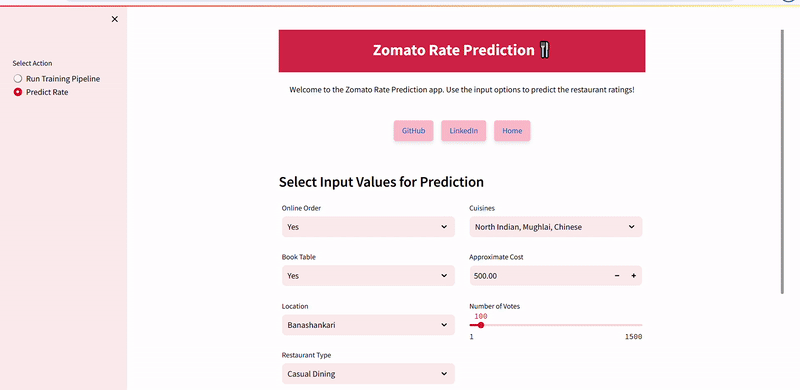
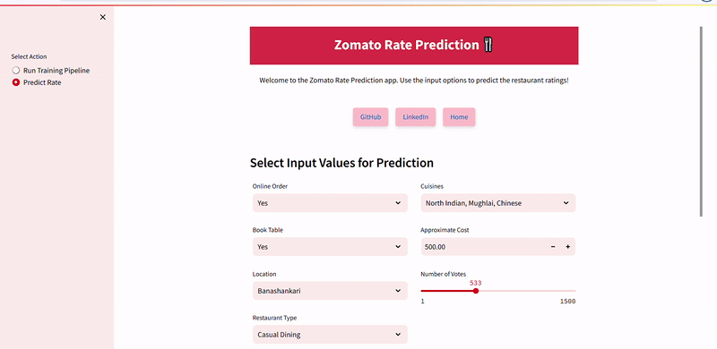

# 📊 Restaurant Rating Prediction  App🚀

This project predicts restaurant ratings using the **Zomato Bengaluru Dataset** from Kaggle. The project implements a robust **MLOps Training Pipeline** in Python 3.12, designed to be modular, scalable, and production-ready.

---


This app predicts restaurant ratings based on user inputs, such as location, cuisine type, and more. Below is an overview of the app's functionality with visual representations of each feature.

---

## 1. Training Pipeline


When you click the **"Run training Pipeline"** button, After clicking **"start training"** button the app starts training the machine learning model. Please note that training can take a significant amount of time, especially if the instance resources are low. Avoid triggering it frequently in such cases. 

---

## 2. Prediction Page


On the **Prediction Page**, accessible via the **"Predict Rate"** button in the sidebar, users can input features to predict restaurant ratings. The input form is split into two sections for ease of use:

### Input Features:
- **Online Order**: Select if the restaurant accepts online orders.
- **Book Table**: Indicate if table booking is available.
- **Location**: Choose the restaurant's location.
- **Restaurant Type**: Specify the type of restaurant.

In another section:
- **Cuisines**: Select the type of cuisines offered.
- **Approximate Cost**: Enter the average cost for two people.
- **Votes**: Adjust the slider to provide the number of votes the restaurant has received.

#### **Important Features**:
The app places a higher weight on features like:
- **Votes**
- **Approximate Cost**
- **Book Table**

These features significantly impact the prediction model's performance.

---

## 3. Prediction Button


After entering the required details, click the **"Predict Rate"** button to get the predicted restaurant rating. The prediction result is displayed clearly, providing actionable insights.

---

### **Key Features**
- **Training and Prediction**: Seamless switching between training and prediction workflows.
- **User-Friendly Interface**: Intuitive and easy-to-use design with a sidebar for navigation.
- **Accurate Predictions**: Designed to emphasize key features like votes and approximate cost for better prediction accuracy.

<h2 align="center">Tools and Technologies Used</h2>
<p align="center">
    &nbsp;&nbsp;&nbsp;
    &nbsp;&nbsp;&nbsp;
    &nbsp;&nbsp;&nbsp;
    &nbsp;&nbsp;&nbsp;
    &nbsp;&nbsp;&nbsp;
    &nbsp;&nbsp;&nbsp;
    &nbsp;&nbsp;&nbsp;
    &nbsp;&nbsp;&nbsp;
    &nbsp;&nbsp;&nbsp;
    &nbsp;&nbsp;&nbsp;
    &nbsp;&nbsp;&nbsp;
    &nbsp;&nbsp;&nbsp;
    
</p>


## 🛠️ Step-by-Step Explanation

### 1. **Environment Setup**
- Python 3.12 environment was created to ensure compatibility and scalability.
- Installed all necessary libraries specified in `requirements.txt`.

### 2. **Project Folder Structure**

```plaintext
Restaurant-Rating-Prediction/
│
├── artifacts/                        # Contains all intermediate and final outputs
├── saved_models/                     # Production-ready models and transformers
│
├── Dockerfile                        # Docker image setup
├── docker-compose.yml                # Docker Compose for multi-container setup
│
├── .github/
│   └── workflows/
│       └── main.yaml                 # GitHub Actions CI/CD pipeline
│
|── templates/                        
│     ├── style.css                   # Custom styling for Web App
│     |__ index.html                  # Web application Documentation
│      
|── src/
│   ├── components/                   # Core pipeline components
│   │   ├── data_ingestion.py         # Handles data collection
│   │   ├── data_validation.py        # Validates raw data
│   │   ├── data_transformation.py    # Prepares data for training
│   │   ├── model_training.py         # Trains the machine learning model
│   │   ├── model_evaluation.py       # Evaluates the model
│   │   └── model_pusher.py           # Pushes the trained model to deployment
│   │
│   ├── config.py                     # Configuration management and environment variables
│   ├── logger.py                     # Logging setup
│   ├── utils.py                      # Utility functions
│   ├── entity/                       # Data structures for pipeline
│   │   ├── config_entity.py          # Configuration-related entities
│   │   └── artifact_entity.py        # Artifacts generated by pipeline stages
│   │
│   ├── pipeline/                     # Pipeline automation
│   │   ├── training_pipeline.py      # Automates training workflow
│   │   └── batch_prediction.py       # Handles batch predictions
│   │
│   └── exceptions.py                 # Custom exception handling
│
├── app.py                            # Streamlit app for restaurant prediction
├── main.py                           # Entry point for training and predictions
├── data_dump.py                      # Dumps data into MongoDB Atlas
├── setup.py                          # Package setup for `src`
├── LICENSE                           # MIT License file
├── README.md                         # Project documentation
├── requirements.txt                  # Dependencies for the project
└── research.ipynb                    # Jupyter notebooks for initial analysis


EC2 aws commands for awscli

Streamlit App Deployment on EC2 using Docker and GitHub Actions

This guide provides step-by-step commands to deploy a Streamlit app on an EC2 instance using Docker, with automatic deployment through GitHub Actions.

Commands for EC2 Setup and Deployment

1. Launch an EC2 Instance using the AWS Management Console with your preferred settings.

2. Connect to Your EC2 Instance:
# Streamlit App Deployment on EC2 using Docker

This guide provides step-by-step commands to manually deploy a Streamlit app on an EC2 instance using Docker.

Commands for Aws Cli after Launching EC2 Instance

```
curl -fsSL https://get.docker.com -o get-docker.sh

sudo sh get-docker.sh

sudo usermod -aG docker ubuntu

newgrp docker
```

```


Github Repo Secrets Setup 

AWS_ACCESS_KEY_ID=

AWS_SECRET_ACCESS_KEY=

AWS_REGION=

AWS_ECR_LOGIN_URI=

ECR_REPOSITORY_NAME=

MONGO_DB_URL=
```

Run All GitHub Runner Commands in AWS CLI and Activate It

1. Set Up GitHub Actions Runner on EC2

1. Navigate to Settings > Actions > Runners in your GitHub repository.
2. Follow the instructions provided by GitHub to download and configure the runner on your EC2 instance.

---

2. Download and Configure GitHub Actions Runner on EC2

Run the following command to download the runner on your EC2 instance:


```bash
curl -o actions-runner-linux-x64-<version>.tar.gz -L https://github.com/actions/runner/releases/download/v<version>/actions-runner-linux-x64-<version>.tar.gz
tar xzf actions-runner-linux-x64-<version>.tar.gz

```
